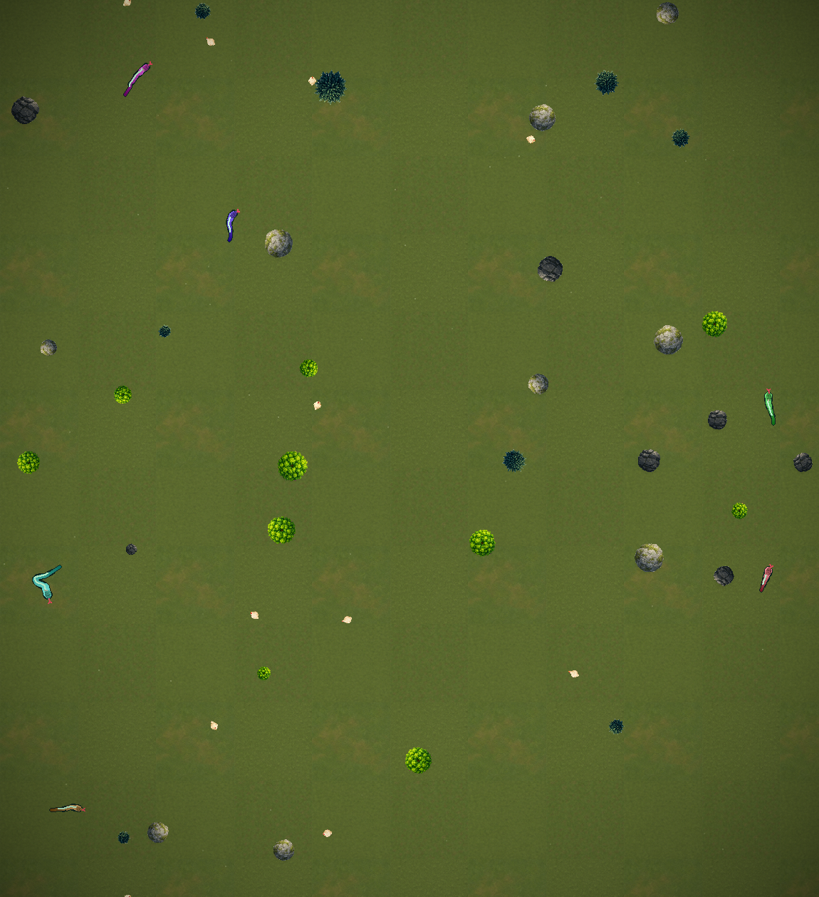

# Snake World

A little **living world** you can leave running like a screensaver. Snakes are born from eggs,
learn to hunt fleeing chickens, court and reproduce, grow old, hunt each other, and die — and
because every snake carries a **heritable genome**, you slowly watch *lineages* diverge: some
lines become fast ambush hunters, some become long-lived breeders, some turn cannibal. Nothing
here is scripted. One neural network drives every snake, and evolution happens live, in front of
you.



---

## Run it (one command)

**Prerequisites:** `git`, and **Python 3.11+** (3.13 recommended). macOS or Linux (on Windows use
WSL or Git Bash). That's it — the launcher builds its own virtual environment and installs
everything (PyTorch, Stable-Baselines3, pygame…) on the first run.

```bash
git clone https://github.com/Matrix-aas/snake-world.git
cd snake-world
./snake watch          # opens the viewer — a trained brain ships with the repo
```

The first `./snake` call sets up a `.venv/` and downloads dependencies (PyTorch is a few hundred
MB, so give it a minute). Every call after that just runs.

```bash
./snake watch --windowed          # run in a window instead of fullscreen
./snake watch --seed 42           # a specific world instead of a random one
./snake watch --headless --episodes 20   # no graphics: print ecosystem stats and exit
```

### Controls (in the viewer)

| Key | Action |
|-----|--------|
| **Arrows** | pan the camera (the map is bigger than the screen) |
| **Tab** | toggle free camera ↔ follow-a-snake |
| **`[` / `]`** | follow the previous / next snake |
| Mouse wheel · **`+` / `-`** | zoom |
| **`I`** | show the followed snake's genome inspector |
| **`S`** · **`H`** | toggle vision rays · the stat rings |
| **`,` / `.`** | slow down / speed up the simulation |
| **`N`** · **Space** · **Esc** | new world · pause · quit |

---

## What you're looking at

Every snake shares **one** PPO-trained brain, but each also carries a **genome** of nine genes that
the brain can *feel* and act on:

- **Body & metabolism** — `size` (reach & strength vs. hunger & turning), `metabolism` (thrifty vs.
  fast-burning), `speed`, `stamina`, `lifespan` (live-fast-die-young vs. long slow breeder).
- **Senses** — `senses` trades eyesight range against sense of smell, so different lines literally
  *perceive the world differently*.
- **Temperament** — `aggression`, `kin_care`, `boldness`.

A snake's genes decide its body, so a fast-fragile snake and a big-slow one have to play completely
different games to survive — and that's where the visible diversity comes from. Genes are inherited:
when two snakes court and the female lays an egg, the egg carries a **crossover + mutation** of both
parents' genomes and its mother's lineage colour. Over many generations, selection (who survives,
who breeds) does the rest. **Evolution is a runtime process — the network is not being trained while
you watch; it's already competent for any genome, and the ecosystem does the evolving.**

Things that emerge on their own, never scripted:

- **Stalk-and-pounce.** Prey fear a snake in proportion to its speed, so a snake that freezes is
  invisible — snakes learn to hold still near a pecking chicken, then strike.
- **Weaving through cover.** Rocks and trees are solid but *not lethal* — charging one just stuns
  you — so snakes learn to slow down and thread gaps rather than avoid clutter.
- **Cut-off kills.** A snake can trap a rival against its own body, leaving a corpse to scavenge.
- **Courtship, guarding, and raiding.** Eggs are edible by others, and the reward only lands when an
  egg actually *hatches*, so parents have a reason to guard — and rivals have a reason to raid.

The map is a **torus** (wrap-around edges), continuous (not a grid), and randomly generated every
launch, so the brain had to learn to live anywhere rather than memorise one map.

---

## Train your own

A trained brain ships in `models/`, but you can grow your own:

```bash
./snake train --steps 8000000 --envs 16 --reset   # from scratch (~1.5–2.5h on a laptop CPU)
./snake train --steps 3000000                      # continue from the current checkpoint
```

Training is headless, CPU-only, and uses self-play: opponents are driven by a synced snapshot of the
same policy, so the brain effectively trains against itself. Watch `snake/eaten_per_window` and
`snake/repro_per_window` climb in the training log — that's hunting and breeding being discovered.

Run the tests with:

```bash
SDL_VIDEODRIVER=dummy PYTHONPATH="$PWD" .venv/bin/python -m pytest -q
```

---

## Project layout

```
snake              # the launcher (build + run in one command)
snake_rl/          # the whole thing
  world.py         #   physics: torus geometry, motion, collisions, reproduction, aging
  genome.py        #   genes → phenotype, crossover, mutation, relatedness
  sensors.py       #   what a snake perceives (vision rays + smell + vibration + proprioception)
  env.py           #   the Gymnasium training environment (reward, action, observation)
  selfplay.py      #   drives in-world opponents from a policy snapshot
  train.py         #   PPO training loop + curriculum
  render.py        #   the pygame viewer
  watch.py         #   the persistent, never-resetting world you watch
docs/              # design docs & specs, if you want to see how it was built
models/            # the trained brain (ships with the repo)
```

`CLAUDE.md` is a deep engineering log of the whole design and its hard-won lessons, if you're
curious how a "living" ecosystem gets tuned.

---

## A note on the AI

It's plain reinforcement learning — [PPO](https://arxiv.org/abs/1707.06347) from
[Stable-Baselines3](https://stable-baselines3.readthedocs.io/), a small MLP, trained on a CPU. The
"aliveness" doesn't come from a big model; it comes from a world with the right pressures (hunger,
prey that fear motion, non-lethal clutter, deferred breeding rewards, heritable trade-offs) so that
believable behaviour is simply the best way to survive.
